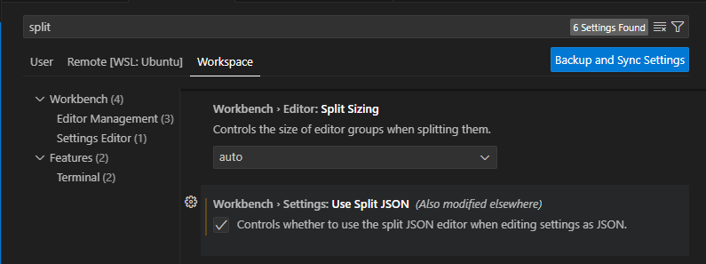
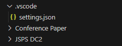

VSCodeでLuaLaTeXを使用するための、設定等について記述しています。

## Extensionの導入
以下の2つのExtensionをinstallしてください。


## `Use Split JSON`の設定
特定のworkspace(folder)のみでLaTeXを動かす場合、まず最初に`Use Split JSON`を`true`にしておきます。  
理由は簡単で、これを行うことでworkspaceごとに`settings.json`の作成・読み込みができるようになります。  
これにより、グローバル環境設定がぐちゃぐちゃになることを避けるためです。  

`ctrl + ,`で設定を開き、`User`, `Remote [WSL:Ubuntu]`, `Workspace`のタブそれぞれで`Use Split JSON`を`true`にします。



これにより、以降でworkspace内に作成する`settings.json`を読み込んでくれるようになります。

## フォルダとファイルの用意
親フォルダ内に`.vscode`というフォルダを作成し、その中に`settings.json`を作成します。  
作成すると、以下のような構造になります。  



もしかしたら，すでに生成されているかもしれません。  
その場合は作成しなくて大丈夫です。

## setting.jsonの記述
`.vscode/settings.json`に、以下のスクリプトをcopy&pasteしてください。
```json title=".vscode/settings.json"
    "[latex]": {
        "editor.tabSize": 2,
        "editor.wordWrap": "on",
        "editor.suggest.snippetsPreventQuickSuggestions": false,
        "editor.bracketPairColorization.enabled": true,
        "editor.unicodeHighlight.invisibleCharacters": true,
        "editor.wordSeparators": "./\\()\"'-:,.;<>~!@#$%^&*|+=[]{}`~?。．、，（）「」『』［］｛｝《》てにをはがのともへでや ",
        "editor.unicodeHighlight.allowedCharacters": {
            "，": true,
            "．": true
        }
    },
    "[bibtex]": {
        "editor.tabSize": 2,
        "editor.wordWrap": "on"
    },
    "files.exclude": {
        // "out/*.bbl": true
        "**/*.log": true,
        "**/*.dvi": true,
        "**/*.fls": true,
        "**/*.aux": true,
        "**/*.blg": true,
        "**/*.out": true,
        "**/*.fdb_latexmk": true,
        "**/*.synctex.gz": true,
        "**/*.nav": true,
        "**/*.snm": true,
        "**/*.toc": true,
        "*Zone.Identifier": true,
        "*/*Zone.Identifier": true
    },
    "latex-workshop.latex.outDir": "out",
    "latex-workshop.latex.tools": [
        {
            "name": "lualatex",
            "command": "lualatex",
            "args": [
                "-synctex=1",
                "-interaction=nonstopmode",
                "-file-line-error",
                "-output-directory=%OUTDIR%",
                "%DOCFILE%.tex"
            ]
        },
        {
            "name": "pbibtex",
            "command": "pbibtex",
            "args": [
                "-kanji=utf8",
                "%OUTDIR%/%DOCFILE%"
            ]
        },
        {
            "name": "platex",
            "command": "wsl.exe",
            "args": [
                "platex",
                "-synctex=1",
                "-interaction=nonstopmode",
                "-file-line-error",
                "-kanji=utf8",
                "-guess-input-enc",
                "%DOCFILE%.tex"
            ]
        },
        {
            "name": "dvipdfmx",
            "command": "wsl.exe",
            "args": [
                "dvipdfmx",
                "-f",
                "yu-win10.map",
                "%DOCFILE%"
            ]
        }
    ],
    "latex-workshop.latex.recipes": [
        {
            "name": "lualatex",
            "tools": [
                "lualatex",
                "pbibtex",
                "lualatex",
                "lualatex"
            ]
        },
        {
            "name": "platex",
            "tools": [
                "platex",
                "platex",
                "dvipdfmx"
            ]
        }
    ]
```

詳細については、以下のページに記載しています。  
上記の`.json`を記述することで、lualatexとbibtexのコンパイルを`ctrl + s`を押すたびに行うようになります。

